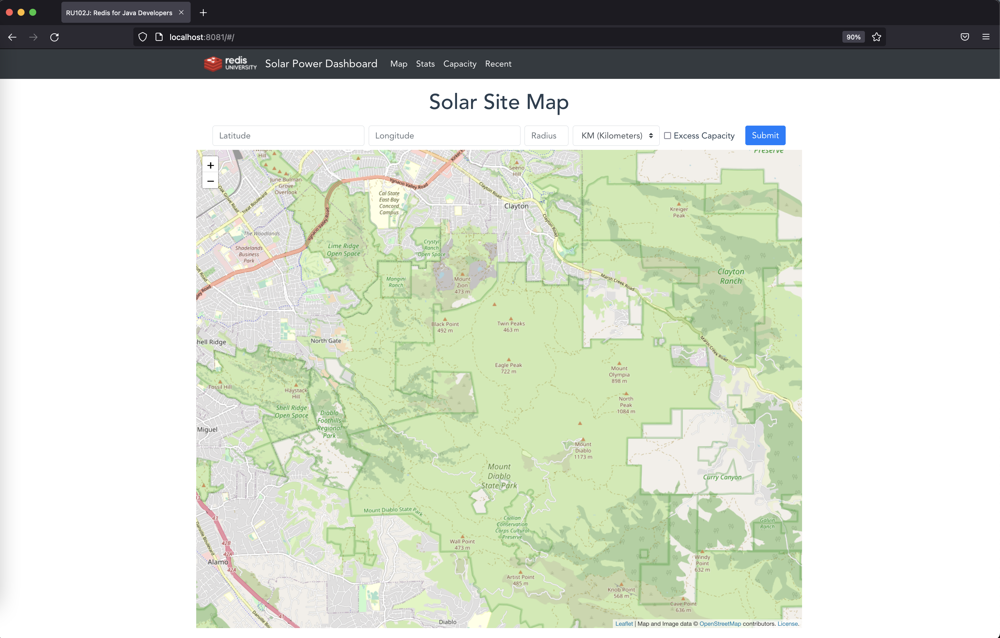

# RediSolar for Java

Introduction
---

This is the sample application codebase for RU102J, [Redis for Java Developers](https://university.redis.com/courses/ru102j/) at [Redis University](https://university.redis.com).

Solutions to the course programming challenges can be found on the `solutions` branch.

Prerequisites
---

In order to start and run this application, you will need:

* Java 8 JDK or higher
* Maven
* Access to a local or remote installation of [Redis](https://redis.io/download) version 5 or newer (local preferred)
* If you want to try the RedisTimeSeries exercises, you'll need to make sure that your Redis installation also has the [RedisTimeSeries Module](https://oss.redis.com/redistimeseries/) installed

If you're using Windows, check out the following resources for help with running Redis:

* [Redis Labs Blog - Running Redis on Windows 10](https://redis.com/blog/redis-on-windows-10/)
* [Microsoft - Windows Subsystem for Linux Installation Guide for Windows 10](https://docs.microsoft.com/en-us/windows/wsl/install-win10)

How to Start the RediSolar Application
---

### When using Redis on localhost, port 6379 with no password:

1. Run `mvn package` to build your application.
2. Load the sample data: `java -jar target/redisolar-1.0.jar load`.  If you want to erase everything in Redis before loading the data, use `java -jar target/redisolar-1.0.jar load --flush true`, but be aware that this will delete ALL keys in your Redis database.
3. Start the application with `java -jar target/redisolar-1.0.jar server config.yml`
4. To check that your application is running enter url `http://localhost:8081`, substituting `localhost` for the hostname that you're running the application on if necessary.

### When using Redis on another host, port or with a password:

1. Edit `config.yml`, setting the values for your Redis host, port and password if needed.
2. Edit `src/test/java/com/redislabs/university/RU102J/HostPort.java`, setting the values for your Redis host, port, and password if needed.
3. Run `mvn package` to build your application.
4. Load the sample data with `java -jar target/redisolar-1.0.jar load --host <hostname> --port <port> --password <password>`.
5. Start application with `java -jar target/redisolar-1.0.jar server config.yml`.
6. To check that your application is running enter url `http://localhost:8081`, substituting `localhost` for the hostname that you're running the application on if necessary.

Tests
---

To run all tests:

```
mvn test
```

To run a specific test:

```
mvn test -Dtest=JedisBasicsTest
```

Building
---

To rebuild the application:

```
mvn package
```

To rebuild the application without running the tests:

```
mvn package -DskipTests 
```

Application Screenshot
---


Subscribe to our YouTube Channel / Follow us on Twitch
---

We'd love for you to [check out our YouTube channel](https://youtube.com/redisinc), and subscribe if you want to see more Redis videos!  We also stream regularly on our [Twitch.tv channel](https://www.twitch.tv/redisinc) - follow us to be notified when we're live.
